# PhishGuard

PhishGuard is an iOS 26 app (SwiftUI, Swift 6) that watches a mailbox with read-only access, checks every new
email on the iPhone itself with a rule engine plus a local language model, throws the email away, and shows a
notification only when the message looks like phishing or a scam. It keeps no mail and never sends mail content
anywhere. It also has Call Guard: a guard phone number you hand out instead of your own. Calls to it ring your
phone as usual while a small relay transcribes and scores the conversation live, so you are warned with an urgent
notification and a spoken warning while you are still on the call.

| It is | It is not |
| --- | --- |
| A watchdog that reads new inbox mail and warns you about suspicious messages | A mail client: it cannot reply, move, delete, label or send mail |
| On-device for mail: analysis, model inference and storage all happen on the iPhone | A cloud scanner: no email text, header or credential ever leaves the phone |
| Read-only by construction: `gmail.readonly`, Graph `Mail.Read`, and an IMAP client that cannot express a write command | A spam filter: it never touches your mailbox and does not act on your behalf |
| Quiet: a local notification is posted only for a verdict at or above the level you choose (default Medium) | A guarantee: it warns about what looks malicious; it can miss things and it can be wrong |
| Call Guard: a guard number whose calls are transcribed and scored as they happen, with a time-sensitive alert and a spoken warning only you hear | Something that listens to your ordinary calls: iOS gives no app access to cellular audio, so only calls placed to the guard number are checked, and for those the audio and transcript leave the phone by design |

## Screenshots

All screens below show the built-in fictional demo data (`-PGDemoData 1` on the Simulator, debug builds). The
senders, subjects and callers are bundled fixtures, not real mail or real calls; the verdicts, reasons and scores
are computed from those fixtures by the shipping detector. The demo runs at the *Low* alert level so that a
low-risk example is visible; the app's default is *Medium*.

**Mail**

<table align="center">
  <tr>
    <td align="center">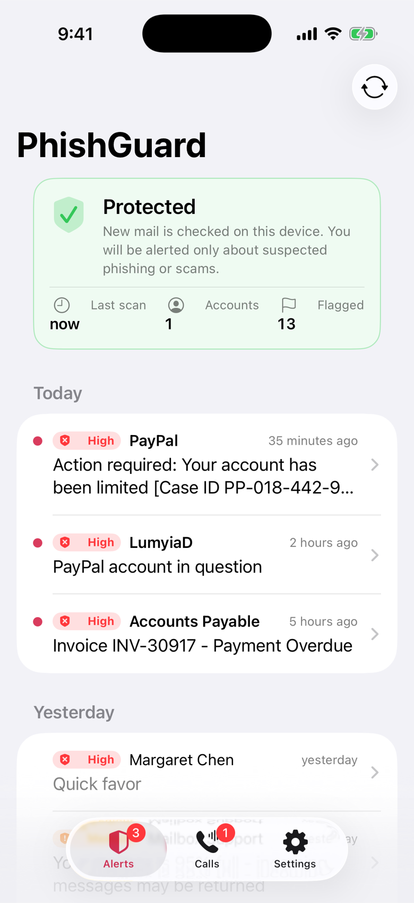</td>
    <td align="center">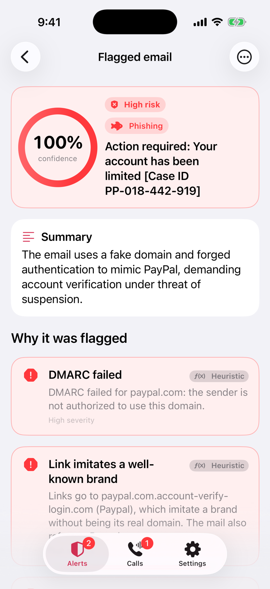</td>
    <td align="center">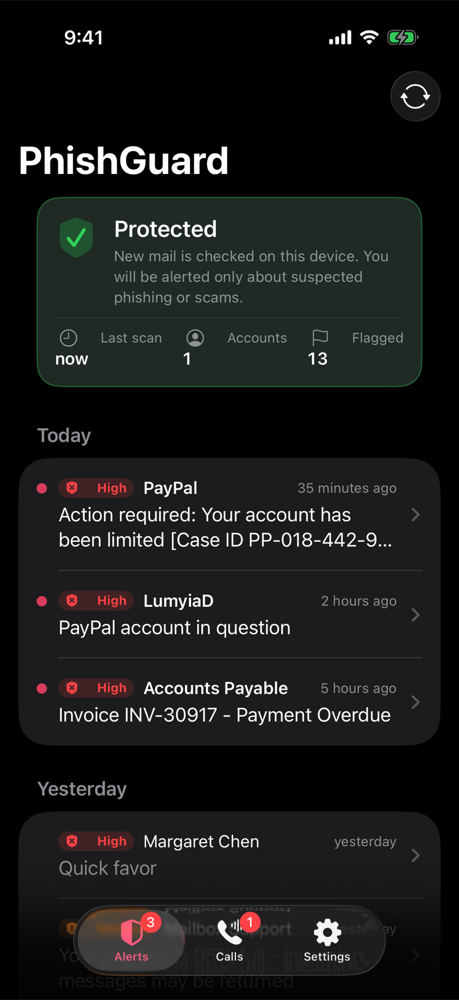</td>
    <td align="center">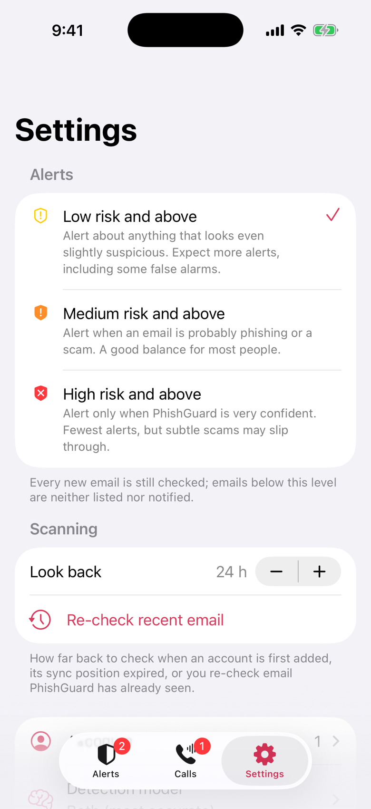</td>
  </tr>
  <tr>
    <td align="center">Alerts</td>
    <td align="center">Why an email was flagged</td>
    <td align="center">Dark mode</td>
    <td align="center">Settings</td>
  </tr>
</table>

**Call Guard**, captured against a relay running a scripted call (the guard and protected numbers are fictional):

<table align="center">
  <tr>
    <td align="center">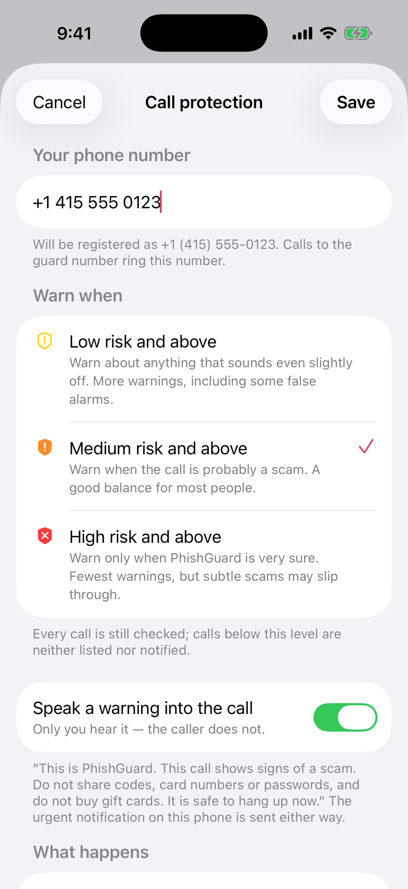</td>
    <td align="center">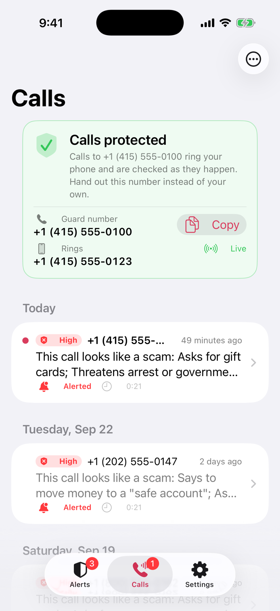</td>
    <td align="center">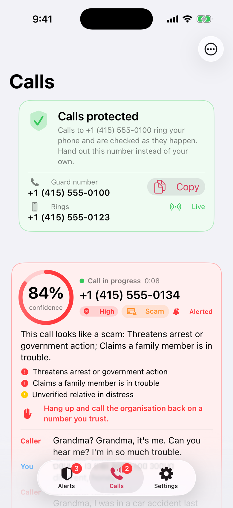</td>
  </tr>
  <tr>
    <td align="center">Set up: your number, alert level, spoken warning</td>
    <td align="center">Protected: the guard number and past flagged calls</td>
    <td align="center">Live: the call scored while it is happening</td>
  </tr>
  <tr>
    <td align="center">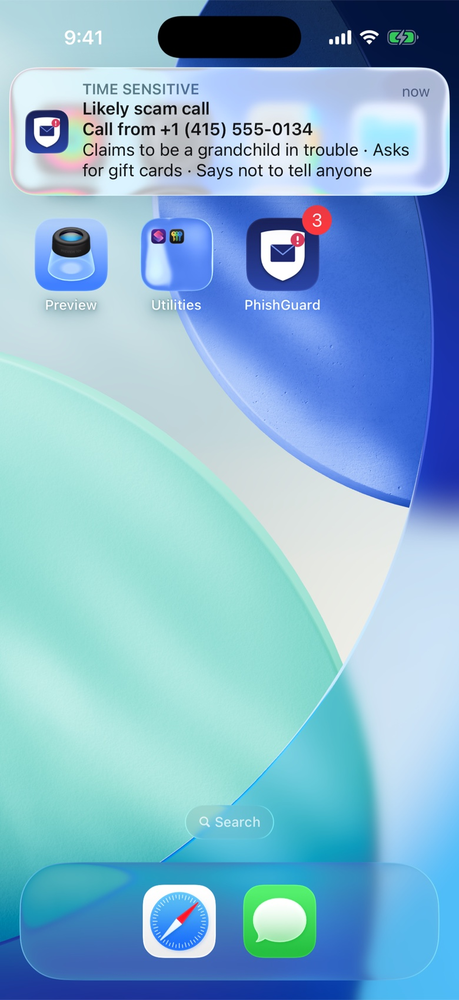</td>
    <td align="center">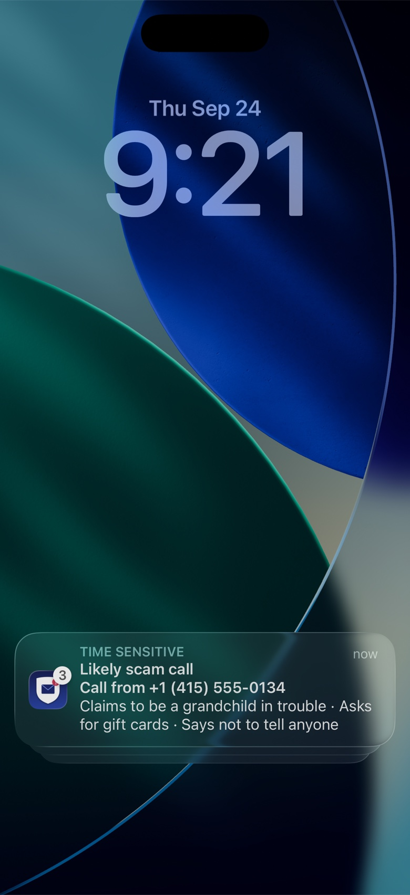</td>
    <td align="center">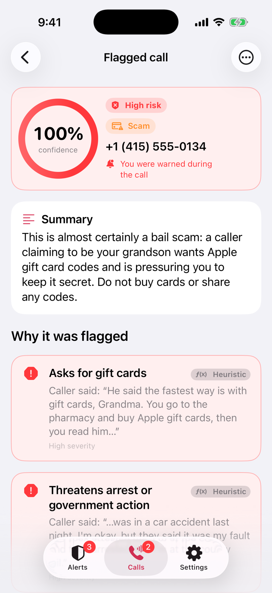</td>
  </tr>
  <tr>
    <td align="center">The time-sensitive alert, mid-call</td>
    <td align="center">The same alert on the Lock Screen</td>
    <td align="center">The call's record afterwards</td>
  </tr>
</table>

The relay's operator console, showing the same scripted call as it is scored:

<p align="center">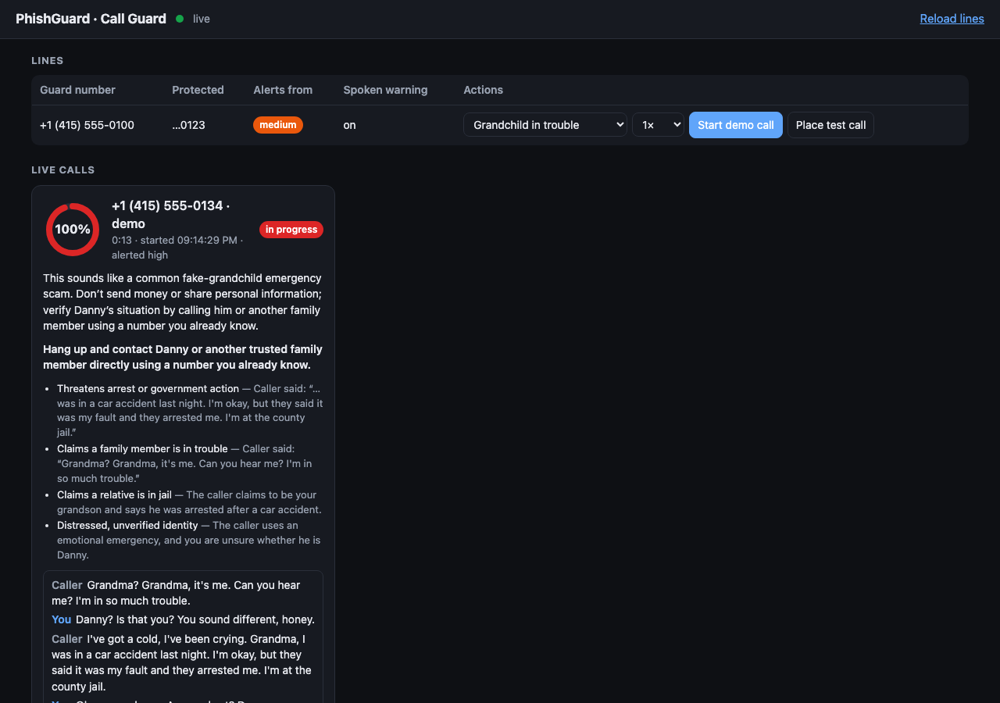</p>

## How an email gets checked

### Accounts

- **Gmail**, signed in with Google OAuth (AppAuth). The only mail scope requested is
  `https://www.googleapis.com/auth/gmail.readonly`, plus `openid` and `email` to learn the address.
- **Outlook.com / Hotmail**, signed in with Microsoft Entra (MSAL). The only mail scope is the delegated Microsoft
  Graph `Mail.Read`, plus `User.Read` to learn the address (MSAL adds `offline_access` itself for token refresh).
- **Any other IMAP mailbox** (iCloud Mail, Yahoo, Fastmail, AOL and others, or a custom server) with an app-specific
  password. IMAP has no scopes, so read-only is enforced in the client: the inbox is opened with `EXAMINE` (never
  `SELECT`), every body fetch is a `.PEEK` so nothing is marked as read, and the write commands (`STORE`, `APPEND`,
  `EXPUNGE`, `COPY`, `MOVE`, `DELETE`) are not representable in the command type at all.

Tokens and passwords live only in the iOS Keychain. Nothing is ever written to a mailbox.

### What is fetched

Only new messages in the inbox: headers, the text and HTML body, and the names, types and sizes of attachments.
Attachment contents are never downloaded. Each account remembers a sync position (Gmail `historyId`, Graph delta
link, IMAP UID), and ids the app has already processed are skipped before any body is downloaded. Without a sync
position the app looks back over a configurable window (default 24 hours, 1 to 168).

### The rule engine

The email is first analyzed by `HeuristicAnalyzer` in the `PhishCore` package: pure Swift, deterministic, and
runnable anywhere. It emits weighted signals with a severity and the evidence it quoted (at most 300 characters,
never a body excerpt beyond that), and folds them into a score from 0 to 1. The signal families:

- **Authentication**: SPF, DKIM, DMARC and ARC results parsed from the receiving provider's
  `Authentication-Results` header, missing authentication, unaligned DKIM, a known brand sending without
  authentication.
- **Sender**: display name versus address, a `Reply-To` or `Return-Path` that does not match, lookalike domains, a
  brand or company name claimed from a free-mail address, `From` equal to the recipient.
- **Links**: anchor text pointing at a different host, brand lookalikes, punycode and IP-literal hosts, credential
  paths, URL shorteners, free hosting, suspicious top-level domains, plain `http`, dangerous schemes.
- **Wording**: urgency, threats, credential requests, gift cards, wire transfers and cryptocurrency, payroll changes,
  QR-code lures, executive impersonation, secrecy, sextortion, hidden text, image-only bodies.
- **Attachments**: executable and double extensions, macro documents, HTML credential lures, archives, invoice lures.
- **Mitigations** that lower the score: an authenticated brand, a DMARC pass, mail from your own organization's
  domains, genuine newsletter headers.

### The on-device classifiers

A second, independent opinion comes from a language model running on the phone. The prompt contains the sender,
subject, headers of interest, the links and up to 2,500 characters of the body; the model answers with a category
(phishing, scam, spam or safe), a risk score from 0 to 100, up to six reasons and a summary. Settings offers four
choices under Detection model:

- **Apple Intelligence** (`FoundationModels`, `SystemLanguageModel.default`): Apple's on-device model with guided
  generation into a typed assessment. Every email gets a fresh single-turn session. When the model refuses a
  message on guardrail grounds (threatening text is exactly what some phishing contains) the app retries once with
  permissive guardrails, a setting that is on by default; a message still refused gets a rules-only verdict. This is
  the one model that also runs in the background.
- **Downloaded model** (MLX): a 4-bit model fetched from Hugging Face during onboarding and run on the GPU with
  `mlx-swift-lm`, greedy decoding, at most 300 output tokens, JSON parsed. The default is
  `mlx-community/Qwen3-4B-Instruct-2507-4bit` (about 2.3 GB, wants an 8 GB iPhone); `Qwen3-1.7B-4bit`,
  `Llama-3.2-3B-Instruct-4bit`, `gemma-3-text-4b-it-4bit` and `gemma-3-1b-it-4bit` are also in the catalog.
  Weights are loaded once per scan and released when the scan ends, on a memory warning, and when the app goes to
  the background.
- **Both** (the default on an iPhone with Apple Intelligence): both models are asked about the same email
  concurrently. The downloaded model is the primary and Apple Intelligence corroborates it: a corroborator's higher
  score is adopted only when something else already noticed the message (the primary scored at least 40, or the
  rules at least 0.3), it can never lower a result, and one model failing never discards the other's answer. In the
  background, where the downloaded model cannot run, Apple Intelligence keeps corroborating the rules.
- **Heuristics only** (rules only): no model. This is also the automatic fallback whenever the chosen model cannot
  answer.

### The verdict

`VerdictEngine` fuses the two detectors on the principle that either may raise the alarm and neither may veto the
other: confidence is the maximum of the rule score and the model's risk score (divided by 100), plus a small
agreement bonus when the model is elevated and the rules found at least one high-severity structural signal
(sender, link, authentication or attachment). Two invariants follow: corroborated rule evidence keeps the
confidence at 0.5 or above, and mail whose brand is authenticated and shows no structural problem is capped at
0.45, which is the only brake on a model that wrongly returns 100. The confidence becomes a level: 0.75 and above
is **high**, 0.5 **medium**, 0.3 **low**, otherwise safe. The category is the model's when it named one other than
safe and the confidence is at least 0.5, and otherwise derived from the signals (credential or link lures are phishing,
payment and impersonation are scams).

### What is kept, and what you see

The `EmailMessage` value is deliberately not `Codable`, so it cannot be persisted by accident; it is discarded as
soon as the verdict exists. For a flagged email the app saves a `FlaggedEmailRecord`: sender name and address,
subject, received and flagged dates, category, confidence, level, the reasons with their quoted evidence, a short
summary, which model decided, a link to open the message in the provider's own app or site, and a read flag.
For every other email the only trace is a content-free dedupe key that is pruned after seven days (or after the
look-back window, if that is longer).

If the level reaches your alert threshold, a local notification is posted: title *Suspicious email flagged*, the
sender as subtitle, the subject and the top reason as body. Tapping it opens the detail screen: the verdict and
level, the summary, *Why it was flagged* with every reason and the evidence behind it, which models ran and which
one decided, and an *Open carefully* link to the original in Gmail, Outlook or your IMAP provider. From there an
alert can be shared as plain-text diagnostics or deleted. Alerts below the threshold are not stored and not shown.

### Background scanning

- **Background App Refresh** (`BGAppRefreshTask`, at the earliest every 15 minutes, 25 seconds of work) and a
  `BGProcessingTask` (120 seconds) that is queued whenever a scan ran out of time with mail still pending.
- **Foreground**: a scan runs every time the app becomes active, and there is a *Scan now* button.
- **The relay "doorbell"** (optional). Gmail's `users.watch` publishes to a Pub/Sub topic and Microsoft Graph sends
  change notifications to a webhook; the relay in `Relay/` receives them, verifies them (Google's OIDC token, or the
  per-subscription `clientState` the app generated), and forwards a silent APNs push to the phone whose payload is
  nothing but the provider name, a salted hash of the address and, for Graph, the lifecycle event name. The phone then scans on the spot. Pushes are
  debounced to one per account every 10 seconds. The app renews its own Gmail watch and Graph subscription before
  they expire. IMAP mailboxes have no push and rely on the first two mechanisms.

The downloaded MLX model only runs while PhishGuard is frontmost, because iOS refuses GPU work from an app in the
background. Background scans therefore use the rules (and Apple Intelligence where selected); the rules alert on
strong evidence by themselves, and the downloaded model takes its second look the next time the app is opened.

### Re-checking mail

Every classified message is recorded so it is never looked at twice, which means a scan cut short or an improved
detector would leave earlier mail unexamined. *Re-check recent email* (Settings > Scanning, and Diagnostics)
clears the processed keys and sync positions for the enabled accounts and scans the look-back window from
scratch. Emails already listed are updated in place rather than duplicated.

### Diagnostics and the model screen

*Diagnostics* (Settings) sends a test notification, runs a test scan over the 33 labelled sample emails bundled
with `PhishCore`, shows the scan log, the background-task history and the last silent push, and in debug builds the
recent model evaluations. *Detection model* downloads, verifies and deletes local models, shows the storage used,
and recommends a model size from the device's RAM.

## Call Guard

iOS gives no app access to live call audio, so PhishGuard owns the call path instead. The relay controls a
**guard number** (a Twilio voice number). You hand that number out, or put it on your contact card, and keep your
real number private.

**The call.** A call to the guard number hits the relay's Twilio webhook, which answers with TwiML that joins the
caller into a conference and, on an upgraded Twilio account, forks the live audio to the relay over Media Streams.
The relay then dials your real phone into the same conference, so the call rings and is answered like any other.
A conference (rather than a plain bridge) is what lets the relay speak to one participant later without ending the
call.

**Transcription and scoring, live.** Each audio track (the caller, and you) is streamed as 8 kHz mu-law to its
own OpenAI Realtime transcription session (`gpt-live-transcribe` by default), so the transcript is speaker-labelled
*Caller:* / *You:*. On a Twilio trial account, which blocks Media Streams, the relay uses Twilio's own real-time
transcription instead; everything downstream is identical. The rolling transcript is scored by the same two-detector
design as mail:

- a deterministic **rule engine** for the classic spoken scams: requests for gift cards, wire transfers or
  cryptocurrency, "move your money to a safe account", remote access to your device, arrest or government threats, a
  family member in trouble, secrecy and "stay on the line", urgency, requests for a code, PIN, password or Social
  Security number, prizes and lotteries, tech-support and refund pretexts, impersonating a bank or agency, payment
  pressure, discouraging you from hanging up, and you reading out a code or card number. A guard keeps genuine
  protective advice (a real fraud desk telling you not to share codes) from triggering it;
- optionally an **OpenAI text model** (`gpt-6-luna` by default) answering a strict JSON schema, called at most every
  three seconds when there is new text, over the most recent 6,000 characters of transcript.

The two are fused exactly like the mail engine: the maximum of the two plus an agreement bonus, then the same
low, medium and high levels. Without an OpenAI key every verdict is rules-only.

**Two warnings.** The first verdict at or above the level chosen for your line (default medium) triggers both, and
later verdicts warn again only when the level rises:

1. A **time-sensitive push** to your iPhone (*Possible scam call* or *Likely scam call*, the caller's number, and
   the top reasons such as *Asks for gift cards · Says not to tell anyone or to stay on the line*). It breaks
   through Focus, expires after two minutes, and tapping it opens the call in the Calls tab.
2. A **spoken warning played into your side of the call only**, via a conference participant announcement: *"This
   is PhishGuard. This call shows signs of a scam. Do not share codes, card numbers or passwords..."* The caller
   never hears it. It can be turned off per line.

**The live console.** The Calls tab shows the call as it happens: a risk gauge, status and elapsed time, the top
reasons, the recommended action, and the last transcript lines (partial ones in italics), fed over a WebSocket from
the relay. The relay also serves an operator console page that shows every line's calls the same way, behind a key
(`CALLS_CONSOLE_KEY`; without one it accepts the relay API key that every app build carries). When the call ends, the Calls tab keeps a record of the call (numbers, times, duration, verdict, reasons,
whether you were warned) that can be opened, marked read, shared as diagnostics or deleted.

**Safety rails.** Every Twilio webhook is checked against its `X-Twilio-Signature`, and every per-call callback
and media URL carries a random per-session token, so nothing can inject audio or events into a call. A call that
would loop (from the guard number, from the protected number, or forwarded from it) is answered with a short spoken
refusal and hung up. There is one line per device: a reinstalled app takes its line over, and *Remove protection*
in the Calls tab deletes the line and its number from the relay.

**Demo and test calls.** Four ways to see it, in increasing order of what you need: a *scripted call on the relay*
(six bundled dialogues, among them a grandchild in trouble, a suspended Social Security number, a Microsoft support
refund, a bank fraud department, a sweepstakes winner and a benign neighbour, fed through the real detector, push
and live feed with no phone and no Twilio); *Simulate a scam call* in Settings > Demo of a debug build (a bundled
verdict and a real notification, nothing leaves the phone); a *test call* Twilio places to your own phone with a
synthesized voice reading the scammer's lines while your replies are transcribed too; and a real call from a second
phone.

**Privacy, stated plainly.** Call Guard is the one PhishGuard feature where content leaves the phone by design,
and only for calls placed to the guard number. The audio goes Twilio > relay > OpenAI (or stays with Twilio's own
transcription on a trial account), the relay holds your phone number in plaintext because it has to dial it, and
the transcript exists in the relay's memory for the call plus 30 minutes, never written to disk, never logged,
never stored on the phone. The relay keeps verdicts, not transcripts; the phone keeps numbers, times and the
verdict, exactly as it keeps no email body. Call recording is never turned on. Your ordinary calls are never
touched.

## Privacy

- **Mail never leaves the phone.** Fetching, rule analysis, model inference and storage all happen on the iPhone.
  No email text, header, link, prompt or model output is uploaded anywhere, including to the relay.
- **Read-only, always.** `gmail.readonly`, Graph `Mail.Read`, and an IMAP client without write commands. Tokens and
  app passwords live only in the Keychain and are never logged.
- **Only flagged emails are stored**, as sender, subject, dates, verdict and reasons; never bodies, attachments or
  raw messages. Everything else leaves only a content-free dedupe key, pruned after seven days (or the look-back window, if longer).
- **The relay knows mailboxes only as hashes.** An account is `SHA256(lowercased address + ":" + salt)`; device
  secrets and Graph `clientState` values are stored as SHA-256 hashes; the SQLite database holds device ids, APNs
  tokens, account hashes, subscription mappings and a one-hour push log. It never receives mail content, mail
  credentials or plaintext addresses, and its logs redact the secrets.
- **Call Guard stores verdicts, not transcripts.** The relay keeps, per line, the protected number and the alert
  settings, and per call the numbers, timestamps, status, verdict and whether it alerted; call records are pruned
  after 30 days. Transcripts live in memory for the call plus 30 minutes and are never written down; phone numbers
  appear in logs as their last four digits. Requests to OpenAI carry `store: false`.
- **Who the app talks to.** Google and Microsoft (your mailbox, sign-in and push subscriptions), Apple (push
  delivery), Hugging Face (only to download a local model), and for Call Guard the relay you host, Twilio and
  OpenAI. Nothing else.
- **Retention on the phone.** Flagged emails and calls stay until you delete them (swipe, or the delete action on
  the detail screen); removing an account deletes its records, revokes or discards its token and unregisters the hash from the
  relay; deleting the app removes everything. There is no analytics, crash-reporting or advertising SDK, and the
  privacy manifest ships in the bundle.

## Architecture

```
project.yml              XcodeGen spec: bundle id, capabilities, Info.plist keys, package dependencies, targets
scripts/                 bootstrap.sh (Secrets.xcconfig from the example + xcodegen), simulate-push.sh and sample APNs payloads
App/PhishGuard/          the iOS app target
  Providers/             MailAccountProvider protocol; Gmail/ (AppAuth + Gmail REST), Microsoft/ (MSAL + Graph delta), IMAP/
  Classification/        ClassifierRegistry, EnsembleClassifier, AppleFoundation/, MLX/ (classifier, ModelManager catalog, downloads)
  Scanning/              ScanCoordinator: fetch > dedupe > analyze > classify > verdict > persist > notify; re-check
  Background/            BGTaskScheduler tasks, silent-push payloads, call-alert routing
  Calls/                 Call Guard client side: relay mirrors, WebSocket client, coordinator (line, live call, history, push)
  Storage/               SwiftData models (LinkedAccount, FlaggedEmailRecord, ProcessedMessage, FlaggedCallRecord), Keychain
  Notifications/         UNUserNotificationCenter wrapper for mail and call alerts
  Relay/                 RelayClient: device, account and subscription registration; authenticated calls and sockets
  Features/              SwiftUI: Onboarding, Home (Alerts), Calls, Detail, Settings, Accounts, Model, Diagnostics, demo support
App/PhishGuardTests/     XCTest: providers against stub HTTP, scan coordinator, ensemble, relay client, background, Call Guard
Packages/PhishCore/      pure Swift package (iOS + macOS, no UIKit): email model, heuristics, authentication-results parsing,
                         domain analysis, prompt builder and output parser, verdict engine, alert policy, labelled fixtures
Relay/                   Node 22 + TypeScript service: doorbell routes, SQLite, APNs; src/calls/ is Call Guard (Twilio webhooks,
                         OpenAI transcriber and scorer, rules, fusion, alerts, live hub, console, demo runner); Dockerfile, fly.toml
Screenshots/             the images above
```

Comments in the code point at the project's internal design documents (`docs/...`), which are not part of this
repository.

**App**: SwiftUI, SwiftData, Swift 6 with strict concurrency (warnings are errors), `FoundationModels` for Apple
Intelligence, MLX Swift (`mlx-swift-lm`, `swift-huggingface`, `swift-transformers`) for the downloaded model,
`BGTaskScheduler` and silent APNs pushes for background work, AppAuth and MSAL for sign-in, Network.framework for
IMAP, `UNUserNotificationCenter` for alerts, `os.Logger` with private redaction throughout.

**Relay**: Node 22, TypeScript, Fastify 5, `better-sqlite3`, `apns2`, `google-auth-library`, the Twilio SDK,
`@fastify/websocket`, OpenAI Realtime (WebSocket) and Chat Completions over plain HTTPS, `vitest` for tests, a
multi-stage Dockerfile.

## Building

Requirements: Xcode 26 with the Metal Toolchain component (`xcodebuild -downloadComponent MetalToolchain`, needed
by MLX), an iPhone on iOS 26 or the iOS 26 Simulator, [XcodeGen](https://github.com/yonaskolb/XcodeGen)
(`brew install xcodegen`), and Node 22.12 or newer for the relay.

```sh
./scripts/bootstrap.sh                       # copies Secrets.example.xcconfig to Secrets.xcconfig, generates PhishGuard.xcodeproj
# fill in App/PhishGuard/Config/Secrets.xcconfig (gitignored), then
open PhishGuard.xcodeproj
```

```sh
cd Relay
cp .env.example .env                         # fill in the values; .env is gitignored
npm install
npm run build
npm start
```

The app runs with the example values: without a relay it scans in the foreground and through Background App
Refresh, and without any account credentials the demo data still shows every screen. The smallest useful relay is
`RELAY_API_KEY`, `RELAY_SALT` and `CALLS_ENABLED=true` in `.env`: that already runs scripted demo calls and the
operator console with no Twilio account, no OpenAI key and no Apple push key. `npm run calls:setup` points a Twilio
number's voice webhook at the relay once you have one. The optional parts need:

- a Google Cloud project with the Gmail API, an OAuth iOS client and a Pub/Sub topic (Gmail accounts, push wake-ups);
- a Microsoft Entra app registration (Outlook.com and Hotmail accounts);
- an Apple push key and a paid Apple Developer team (silent pushes, Call Guard alerts, time-sensitive delivery);
- a Twilio account with a voice number (the guard number; a trial works within its limits);
- an OpenAI API key (Realtime transcription on an upgraded Twilio account, and the model's verdict on calls).

Tests:

```sh
cd Packages/PhishCore && swift test          # the rule engine, verdict engine and fixtures, no Xcode project needed

xcodebuild -project PhishGuard.xcodeproj -scheme PhishGuard \
  -destination 'platform=iOS Simulator,name=iPhone 17 Pro' \
  -skipMacroValidation -skipPackagePluginValidation -only-testing:PhishGuardTests test

cd Relay && npm test
```

Demo mode: in a debug build, Settings > Demo seeds a fictional week of flagged emails and calls next to your real
data (turning it off removes only those rows) and can simulate an incoming flagged email or scam call complete with
the notification. On the Simulator, the debug-only launch argument `-PGDemoData 1` seeds the same data at start-up, which is how
the screenshots above were taken (`-PGInitialTab calls`, `-PGOpenNewestRecord 1`, `-PGOpenNewestCall 1` and
`-PGDemoCall <scenario>` pick the screen or start a scripted call).

## Limitations

- **It warns; it does not guarantee.** Alerts are advisory: the app never acts on mail or calls and cannot replace
  judgement. It can miss things and it can be wrong.
- **Only the inbox is watched.** Mail the provider already moved to Spam or Junk is not scanned, and background
  delivery is best effort (pushes are discretionary, Low Power Mode turns Background App Refresh off), so an alert
  may arrive minutes after the email.
- **Call Guard only covers calls placed to the guard number.** iOS gives no app access to ordinary call audio, and
  forwarding your real number to the guard number would loop. For those calls the audio and transcript leave the
  phone. A Twilio trial reaches verified numbers only, plays a preamble and blocks Media Streams.
- **The downloaded model needs a recent iPhone.** The default model wants an 8 GB iPhone (the smaller catalog
  entries fit 6 GB and 4 GB devices with less accuracy), does not run on the Simulator, and runs only while the app
  is in the foreground. Apple Intelligence is used where the device offers it.
- **This is a private demo project.** It has been exercised on the author's own devices and accounts, not through
  Google's restricted-scope verification or the App Store, and the relay is something you host yourself.
